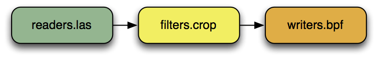

.. _pdal_intro:

Introduction to PDAL
================================================================================

.. include:: ../../includes/substitutions.rst

* Point Data Abstraction Library
* "GDAL for point cloud data"
* Focus (in priority)

  1. Translation
  2. Processing
  3. Exploitation

.. image:: ./_static/pdal_logo.png
    :target: http://pdal.io

Open Source
================================================================================

* https://pdal.io
* https://github.com/PDAL/PDAL
* `Tested with every commit`_
* 30+ `contributors`_
* Driven by real world use
* `BSD`_ license

.. _`Tested with every commit`: http://travis-ci.org/PDAL/PDAL/builds/
.. _`BSD`: https://opensource.org/licenses/BSD-2-Clause
.. _`contributors`: https://github.com/PDAL/PDAL/graphs/contributors

History
================================================================================

* Started in 2010
*

  .. image:: ./_static/liblaslogo.png
    :target: http://liblas.org

* Used by `USACE GRiD`_ project for data warehousing

  .. image:: ./_static/rsgis_logo.png
    :target: http://lidar.io
    :scale: 25%

.. _`USACE GRiD`: http://lidar.io

.. role:: strike
    :class: strike

:strike:`GDAL` PDAL's Niche
================================================================================

* On-disk or over-the-wire data format is a function of software requirements
* Immature industry-wide standards (think vector world pre-shapefile)
* Formats are proliferating quickly as the lidar/radar/sonar software industry expands
* Need for basic processing operations

Processing Pipeline
================================================================================

* :ref:`C++ core library <api>` implementation
    * :ref:`Stages <stage_index>` specialize implementation
    * :cpp:class:`PointView <pdal::PointView>` transits data
* :ref:`Pipelines <pipeline>` orchestrate operations
* :ref:`Applications <apps>` invoke pipelines

Pipeline Architecture
================================================================================

Pipeline Architecture
================================================================================

.. image:: ../../images/pdal-architecture-overview.png

Readers (file)
================================================================================

* :ref:`ASPRS LAS <readers.las>`
* :ref:`BPF <readers.bpf>`
* :ref:`MrSID <readers.mrsid>`
* :ref:`text <readers.text>`
* :ref:`PCD (PCL)<readers.pcd>`
* :ref:`PLY <readers.ply>`
* :ref:`ILVIS2 <readers.ilvis2>`
* :ref:`NITF <readers.nitf>`

Readers (database)
================================================================================

* :ref:`PostgreSQL <readers.pgpointcloud>`
* :ref:`Oracle <readers.oci>`
* :ref:`SQLite <readers.sqlite>`

Writers (file)
================================================================================

* :ref:`ASPRS LAS <writers.las>`
* :ref:`BPF <writers.bpf>`
* :ref:`text <writers.text>`
* :ref:`PCD (PCL)<writers.pcd>`
* :ref:`PLY <writers.ply>`
* :ref:`NITF <writers.nitf>`

Writers (database)
================================================================================

* :ref:`PostgreSQL <writers.pgpointcloud>`
* :ref:`Oracle <writers.oci>`
* :ref:`SQLite <writers.sqlite>`

Filters
================================================================================

* :ref:`Geographic attribute assignment <filters.overlay>`
* :ref:`Polygon clipping <filters.crop>`
* :ref:`Splitting by volume <filters.chipper>`
* :ref:`Splitting by geometry <filters.divider>`
* :ref:`Splitting by count <filters.splitter>`
* :ref:`Coloring with imagery <filters.colorization>`

Filters (cont)
================================================================================

* :ref:`Ground classification<filters.smrf>`
* :ref:`Normalized heights <filters.hag>`
* :ref:`Sorting <filters.sort>`
* :ref:`Spatial curve sorting <filters.mortonorder>`
* :ref:`Noise filtering <filters.outlier>`
* :ref:`Merge<filters.merge>`

Filters (cont)
================================================================================

* :ref:`Reprojection <filters.reprojection>`
* :ref:`Statistics <filters.mortonorder>`
* :ref:`Cropping <filters.crop>`
* :ref:`Voxel sampling<filters.voxelgrid>`
* :ref:`Poisson sampling<filters.poisson>`
* :ref:`Range filter<filters.range>`
* :ref:`Rank decimation <filters.decimation>`
* :ref:`Boundary computation<filters.hexbin>`

Python
================================================================================

* Extension

  * Use PDAL to read data into your own applications

* Embed

  * Use Python inline with :ref:`pipeline <pipeline>` operations

Python (cont)
================================================================================

.. code:: python

    def filter(ins,outs):
       # Keep only points with classification 1 or 2
       cls = ins['Classification']

       keep_classes = [1,2]

       # Use the first test for our base array.
       keep = np.equal(cls, keep_classes[0])

       # For 1:n, test each predicate and join back
       # to our existing predicate array
       for k in range(1,len(keep_classes)):
           t = np.equal(cls, keep_classes[k])
           keep = keep + t

       outs['Mask'] = keep
       return True

Matlab
================================================================================

* :ref:`writers.matlab` and :ref:`readers.matlab` for i/o

* Embed

  * Use Matlab scripts inline with :ref:`pipeline <pipeline>` operations

Next
================================================================================

On to :ref:`software`

