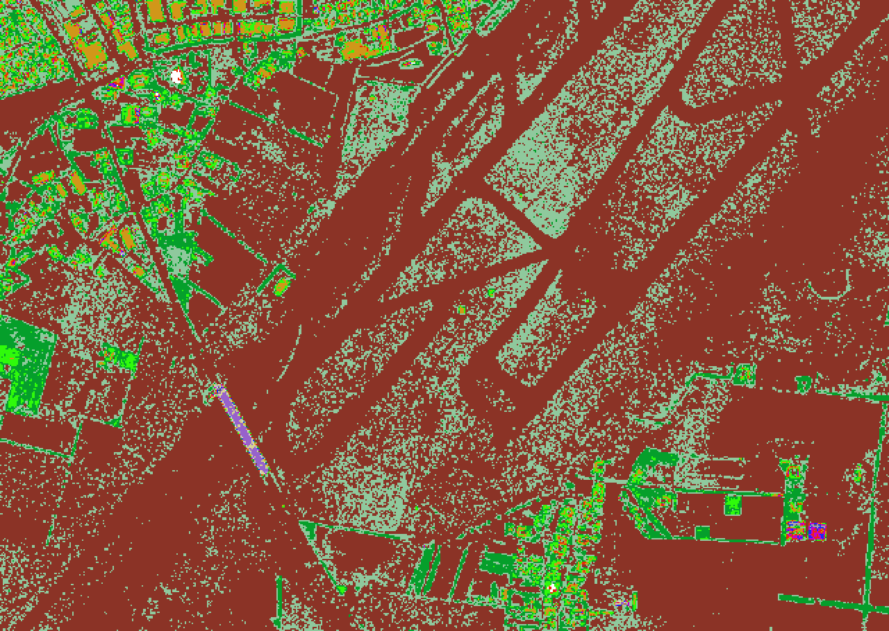

.. _rasterization:

Rasterizing Attributes
================================================================================

.. include:: ../../includes/substitutions.rst

Purpose:
    * Utilize :ref:`readers.ept`
    * Interpolate data (Intensity, Classification)
    * Use `gdaldem`_ to apply color ramps
    * Explore :ref:`writers.gdal` options

.. _`gdaldem`: http://www.gdal.org/gdaldem.html

:ref:`readers.ept`
================================================================================

  .. literalinclude:: ../../exercises/analysis/rasterize/classification.json

:ref:`pdal pipeline <pdal:pipeline>`
================================================================================

.. literalinclude:: ../../exercises/analysis/rasterize/classify-command.txt

Yuck
================================================================================

.. image:: ../../images/rasterization-denmark-no-ramp.png

Color Ramp
================================================================================

.. literalinclude:: ../../exercises/analysis/rasterize/ramp.txt

`gdaldem`_
================================================================================

.. literalinclude:: ../../exercises/analysis/rasterize/gdaldem-run-command.txt

Better
================================================================================

Intensity
================================================================================

.. literalinclude:: ../../exercises/analysis/rasterize/intensity-run-command.txt
    :linenos:

Intensity Image
================================================================================

.. image:: ../../images/rasterization-colored-intensity.png

Next
================================================================================

On to :ref:`workshop-histogram`

