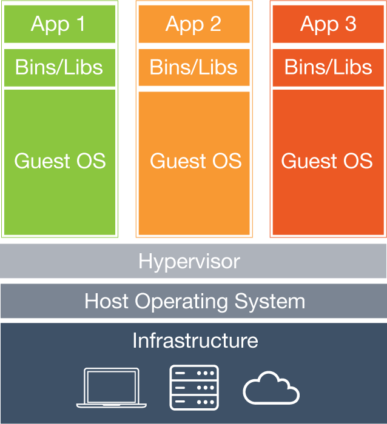

.. _software:

Software installation
================================================================================

1. :ref:`Docker <docker>`
    * Run PDAL and GDAL command line applications

2. :ref:`QGIS<qgis>`
    * Visualize vector and raster data

3. `QT Reader`_
    * Visualize point cloud data

4. `Fugro Viewer`_
    * Visualize point cloud data

5. http://plas.io
    * Visualize point cloud data

6. `CloudCompare`_
    * Visualize point cloud data

.. _`QT Reader`: http://appliedimagery.com/download/
.. _`Fugro Viewer`: http://www.fugroviewer.com/
.. _`CloudCompare`: http://www.danielgm.net/cc/

File copying
================================================================================

1. Copy entire contents:

::

    C:\Users\Howard\PDAL

2. Navigate to ``software`` directory:

::

    c:\Users\Howard\PDAL\software

Docker Installation
================================================================================

.. image:: ../../images/docker-file-navigate.png

1. :ref:`Docker <Docker>`
2. :ref:`QGIS`

Docker
================================================================================

* Containerization
* Not virtual machines
* Operating system isolation

Virtual Machine
================================================================================

Docker
================================================================================

.. image:: ./img/docker-diagram.png
    :target: https://www.docker.com/what-docker
    :scale: 75%

Why Docker?
================================================================================

* Rapid development
* Compiling is pain
* Windows development is pain
* Old software is pain

Compile yourself?
================================================================================

Benefits
================================================================================

* Freshies
    * Short bug fix cycle

* Known configuration
    * Developer configures
    * *All* the features

* Replicability of configuration
    * Runs the same on all machines
    * Inspectable
    * Repeatable bugs

How it works
================================================================================

* Linux
* On Windows, you actually run on a Linux VM
    * Same on Mac
    * We will use `VirtualBox`_
    * `Docker Toolbox`_ does all of it for us
    * Both free and open source

.. _`VirtualBox`: https://www.virtualbox.org/wiki/Downloads
.. _`Docker Toolbox`: https://www.docker.com/products/docker-toolbox

Next
================================================================================

On to :ref:`basic_info`
