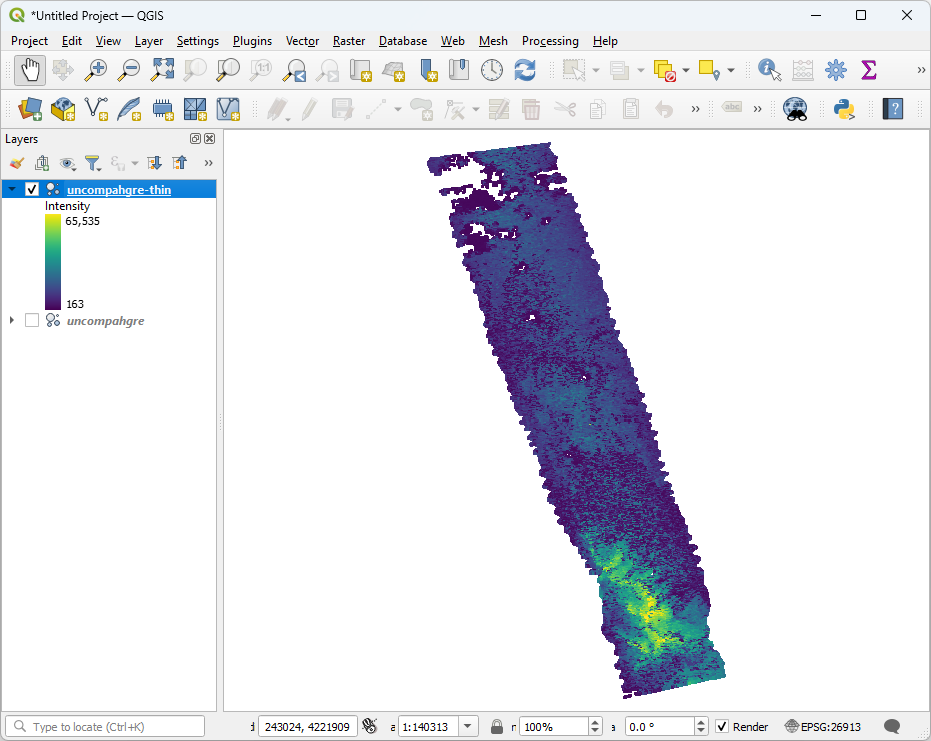

.. _thinning:

Thinning
================================================================================

.. include:: ../../includes/substitutions.rst

Purpose:
    * Reduce collection density

:ref:`Thinning Workshop Materials <pdal:thinning>`

PDAL Thinning Techniques
================================================================================

* :ref:`filters.sample`
* :ref:`filters.voxelgrid`
* :ref:`filters.randomize` + :ref:`filters.decimation`

Dart sample
================================================================================

* Poisson [Cook1986]_ and [Dippe1985]_.
* Non-destructive
* Settable threshold

.. [Cook1986] Cook, Robert L. "Stochastic sampling in computer graphics." *ACM Transactions on Graphics (TOG)* 5.1 (1986): 51-72.

.. [Dippe1985] Dippé, Mark AZ, and Erling Henry Wold. "Antialiasing through stochastic sampling." *ACM Siggraph Computer Graphics* 19.3 (1985): 69-78.

Voxel grid
================================================================================

* Little boxes
* Uniform
* Approximated by centroid
* Destructive

Random + Decimate
================================================================================

* Decimation filter just keeps every X point
* Insensitive to density

Thinning (overview)
================================================================================

.. image:: ../../images/thinning-overview.png

Thinning (dart command)
================================================================================

.. image:: ../../images/thinning-command-run.png

Thinning (before)
================================================================================

.. image:: ../../images/thinning-full-res.png
    :scale: 70%

Thinning (after)
================================================================================

Next
================================================================================

On to :ref:`ground`
