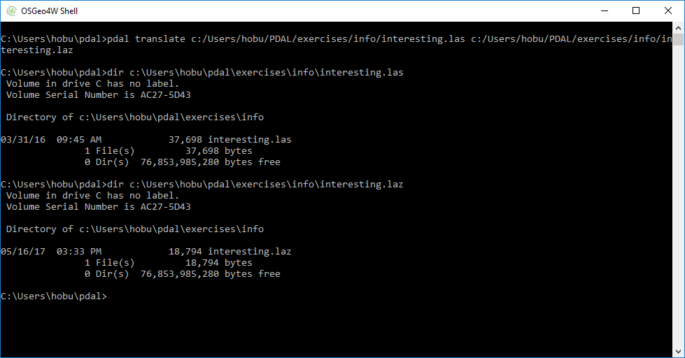

.. _translation:

Translation
================================================================================

.. include:: ../../includes/substitutions.rst

* Convert one format to another
* Do stuff along the way

Compression
================================================================================

Purpose:
    * Output a compressed |LASzip|
    * Learn about point cloud metadata
    * Learn about |ASPRSLAS|

:ref:`Compression Workshop Materials <pdal:compression>`

.. _`LAZ`: http://laszip.org

LASzip
================================================================================

* |ASPRSLAS| data model
* Typical 5:1 to 10:1 ratios
* Incremental, interruptable, and chunkable
* Unencumbered open source
* C++ and JavaScript

Command (compression)
================================================================================

.. literalinclude:: ../../exercises/translation/compression-command.txt
    :linenos:

* PDAL chooses option based on filename extension
* Not all extensions work
* Imprecise. Use :ref:`pipeline` if you need
  to be explicit

Verify (compression)
================================================================================

Reprojection
================================================================================

Purpose:
    * Transform data in one coordinate system
      to another
    * Utilize driver options
    * Scale output data

:ref:`Reprojection Workshop Materials <pdal:reprojection>`

Command (reproject)
================================================================================

.. literalinclude:: ../../exercises/translation/reprojection-command-1.txt

* We tell :ref:`filters.reprojection` to output to ``EPSG:4326``
* Add ``reprojection`` filter directly to ``translate`` command
* Define reprojection filter option via command line

Command (bad scale)
================================================================================

.. image:: ../../images/reprojection-wrong-scale.png

Command (scale)
================================================================================

.. literalinclude:: ../../exercises/translation/reprojection-command-2.txt

* Scale set to ``1e-7``
* Offset to ``auto`` (PDAL calculates minimum)

Command (verify)
================================================================================

.. image:: ../../images/reprojection-proper-scale.png

Next
================================================================================

On to :ref:`analysis`
